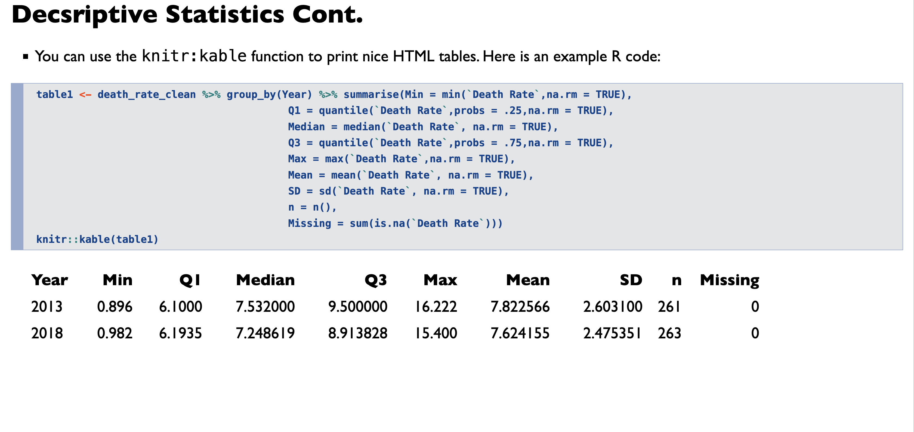
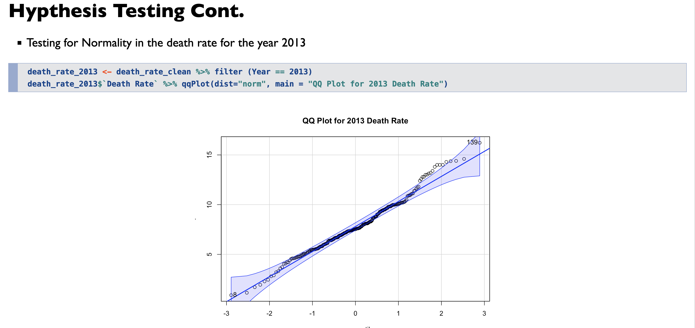
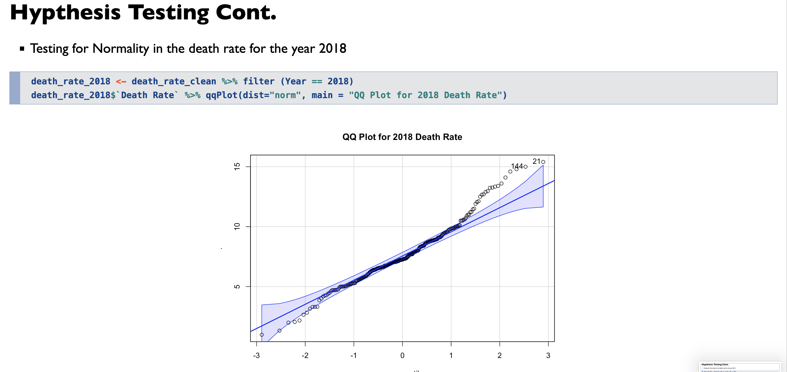
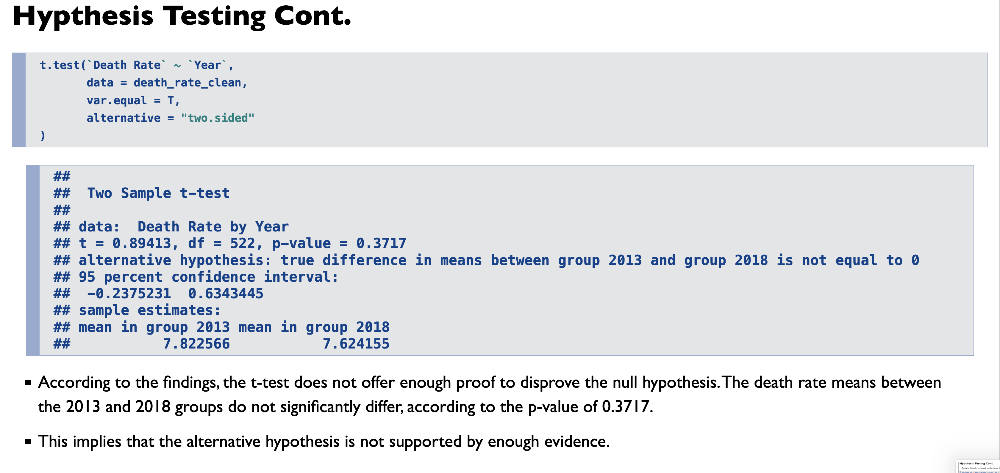

# Global Mortality Comparison 📈

## Introduction
The analysis aims to investigate whether there was a statistically significant shift in the death rate across various nations between the years 2013 and 2018. The study uses data sourced from The World Bank, specifically focusing on death rates per 1000 people.

## Rpubs Link
- The Rpubs link for the presentation can be found [here](https://rpubs.com/ChrisJohn/1117120).

## Problem Statement
The research question explores the potential progress countries were making in developing better hospitable conditions for citizens before the COVID-19 pandemic. The analysis involves generating descriptive statistics, visualizing the data through box plots, and conducting hypothesis testing to determine if there was a significant difference in death rates between the selected years.

## Preview

## Data
- The data used in this investigation was acquired from The World Bank.
- Data source URL: [World Bank Death Rate Data](https://data.worldbank.org/indicator/SP.DYN.CDRT.IN?name_desc=false)
- The dataset comprises death rates across 266 countries from the years 1960 to 2020.

## Setup and Packages
- The R Markdown document uses several packages for analysis, including `tidyverse`, `car`, and `knitr`. The setup chunk loads these packages.

## Data Cleaning and Transformation
- The data is read into the R environment and filtered to include relevant columns.
- Data is pivoted to a longer format for analysis.
- Descriptive statistics are generated, and missing values are handled appropriately.

## Descriptive Statistics and Visualization
- Descriptive statistics are calculated and presented in a table.
- Box plots are used to visualize the distribution of death rates across years.

## Hypothesis Testing
- Hypothesis testing is performed to determine if there is a significant difference in death rates between 2013 and 2018.
- Assumptions such as normality and homogeneity of variances are validated.
- A t-test is conducted to compare means, and results are discussed.

## Discussion
- Findings are summarized, and the strengths and weaknesses of the study are highlighted.
- Suggestions for future investigations and conclusions are provided.

## References
- The analysis relies on data from The World Bank. Reference to the data source is included.

Feel free to customize this README based on additional information or specific details related to your project.
